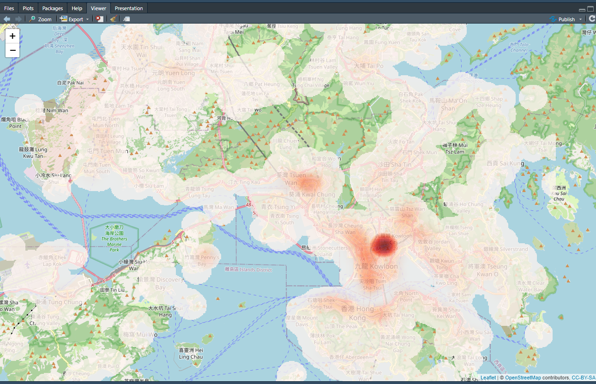
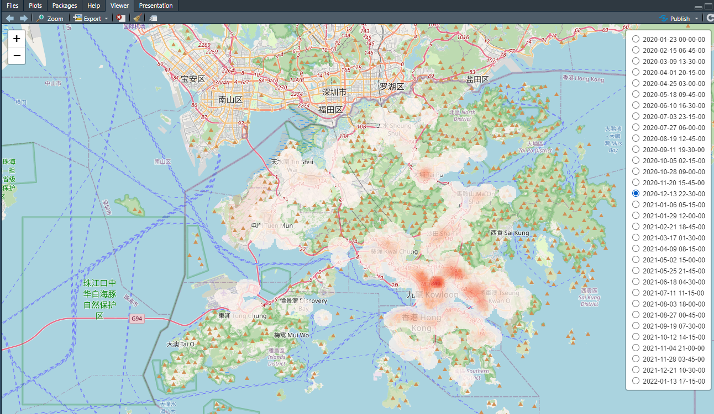

# Rlibkdv


The goal of Rlibkdv is to provide a versatile kernel density visualization R package for geospatial analytics.

With our Rlibkdv, you can quickly generate high-resolution kernel density visualizations, supporting advanced analysis tasks such as bandwidth-tuning and spatiotemporal analysis.

## Installation

The latest version of Rlibkdv at CRAN is available at:
<https://CRAN.R-project.org/package=Rlibkdv>

You can install the stable version of Rlibkdv from CRAN with:

``` r
install.packages("Rlibkdv")
```

You can install the development version of Rlibkdv from
[GitHub](https://github.com/) with:

``` r
library(devtools)
devtools::install_github("bojianzhu/Rlibkdv", force=TRUE, dependencies=FALSE, upgrade="never")
```

## Examples

**Kernel Density Visualization**:

``` r
library(Rlibkdv)
data(hk)
resKDV <-kdv(hk$lon, hk$lat, 1000.0, 800, 640)
plotKDV(resKDV)
```



**Spatiotemporal Kernel Density Visualization**:

```R
library(Rlibkdv)
data(hk)
resSTKDV <- stkdv(hk$lon,hk$lat,hk$t, 1000.0, 6.0, 800, 640, 32)
plotSTKDV(resSTKDV)
```

